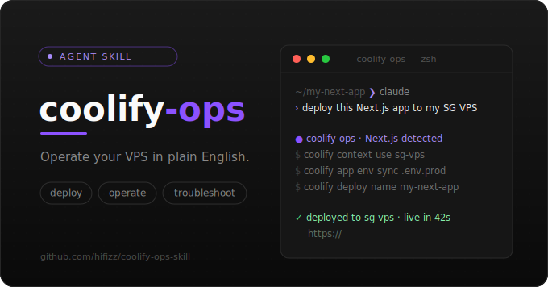

<p align="center">
  
</p>

# coolify-ops

[English](README.md) | **简体中文**

> 一个 **Claude Code / Codex Agent Skill**——用自然语言驱动官方 [`coolify` CLI](https://github.com/coollabsio/coolify-cli)，远程完成自托管 [Coolify](https://coolify.io) 实例上应用 / 服务 / 数据库的**部署、运维与排障**。

**底层全靠官方 CLI 干活**：本 skill 自己不碰你的服务器，而是把你的自然语言意图翻译成 [coollabsio/coolify-cli](https://github.com/coollabsio/coolify-cli) 命令来执行；CLI 再通过 Bearer Token 调 Coolify 的 REST API 完成操作（用的是 REST API,不是服务器的 SSH 登录）。CLI 在持续演进，skill 鼓励 Agent 用 `coolify <cmd> --help` 自查 flag，避免版本漂移。

装好后，直接对 Agent 说人话即可，例如：

- 「把 my-app 重新部署一下，部署完跟我说结果」
- 「线上那个 worker 好像挂了，帮我查下日志」
- 「把 .env.production 同步到 my-app 再重新部署」

Agent 会自动启用本 skill：查 UUID → 触发部署 → 跟随日志 → 报告结果，**危险操作前会先与你确认**。

## 环境要求

- 一台自托管的 **Coolify** 实例（典型：一台 VPS + 已部署若干 Node / Next.js / Docker 服务）。
- 一个 Coolify **API Token**（在 Web UI 的 `/security/api-tokens` 生成）。**按最小权限授予**：日常运维用 `read` + `deploy`,改配置 / 创建资源才加 `write`,**绝不**给 Agent 用 `root` token。详见 [`references/safety-rules.md`](references/safety-rules.md)。
- 官方 **coolify CLI**（[coollabsio/coolify-cli](https://github.com/coollabsio/coolify-cli)，Go 版本，可用下方脚本一键安装）。
- **Claude Code**，或其它支持 `SKILL.md` 的 Agent（如 Codex）。

> 兼容性：已在 coolify-cli v1.6.2 / Coolify v4.1.1 上测试。

## 安装

### 通过 [skills.sh](https://skills.sh)（推荐）

装了 Node.js 的话，一条命令即可把本 skill 装进你的 Agent（无需手动 clone）：

```bash
# 项目级——装到 ./.claude/skills（在项目目录内运行时的默认行为）
npx skills add hifizz/coolify-ops-skill

# 全局 / 用户级——装到 ~/.claude/skills（所有项目可用）
npx skills add hifizz/coolify-ops-skill -g

# 显式指定目标 Agent（默认用检测到的那个）
npx skills add hifizz/coolify-ops-skill --agent claude-code
```

这会从本仓库拉取 `coolify-ops` 这个 skill。之后可用以下命令管理：

```bash
npx skills list                 # 列出已安装的 skill
npx skills update coolify-ops   # 更新到最新版
npx skills remove coolify-ops   # 卸载
```

> `skills.sh` 支持各类兼容 Agent —— Claude Code、Codex、Cursor、Copilot、Windsurf 等。可在 [skills.sh](https://skills.sh) 浏览目录。

### 手动安装

不想用 `npx`？clone 后把 skill 目录拷进 Agent 的 skills 目录（目录名须为 `coolify-ops`，与 skill 的 `name` 一致）：

```bash
git clone https://github.com/hifizz/coolify-ops-skill

# Claude Code · 全局（对所有项目生效）
cp -r coolify-ops-skill ~/.claude/skills/coolify-ops

# Claude Code · 项目级（只对当前项目）
cp -r coolify-ops-skill .claude/skills/coolify-ops
```

Codex 等其它 Agent，放到其对应的 skills 目录。

## 首次配置

第一次让 Agent 操作前，装好 CLI 并配好连接（context）：

```bash
# 1) 安装官方 coolify CLI（macOS / Linux 自动检测；已装则跳过）
#    路径取决于安装范围：全局是 ~/.claude/skills/...，项目级是 ./.claude/skills/...
bash ~/.claude/skills/coolify-ops/scripts/install-cli.sh

# 2) 添加并设为默认 context（token 在 Coolify Web UI /security/api-tokens 生成）
coolify context add my-vps https://coolify.your-domain.com <token> -d

# 3) 验证连通性与鉴权
coolify context verify
```

## 怎么用

配好之后无需记命令——直接用自然语言描述要做的事，Agent 会自动启用本 skill 并执行。常见场景：

- **部署 / 重新部署**：「重新部署 my-app」「把这次改动发上线」
- **排障**：「xxx 服务 502 了帮我看看」「查下最近一次部署为什么失败」
- **环境变量**：「把 .env.production 同步到 my-app」「给它加一个 `NEXT_PUBLIC_API_URL`」
- **生命周期**：「重启那个数据库」「先把 worker 停了」
- **数据库与备份**：「给 my-db 配每天 2 点的备份」「让这个库能被我本地连」
- **域名 / 资源**：「给它绑个域名」「内存调到 1G」

## 能力

| ✅ CLI 能做 | 🖥️ Web UI 仍更顺手 |
|---|---|
| **创建应用**：从公开 / 私有 git 仓库、Dockerfile 或镜像（`app create`） | 首次可视化搭建、浏览一键模板 |
| **创建一键服务**（`service create --list-types`） | 实时仪表盘、指标与资源图表 |
| 创建与备份数据库 | 少数高级 / 纯可视化设置 |
| 部署 / 重新部署、跟随日志、排障 | |
| 环境变量同步（`env sync` 批量增改） | |
| 生命周期管理（start / stop / restart） | |
| 数据库对外访问决策（内网 / 隧道 / 公网加固） | |

> CLI 现已覆盖资源的从零创建；Web UI 仍适合可视化搭建、仪表盘和少数高级设置。

## 注意点

- **危险操作要确认**：删库 / 删应用 / 停生产 / 强制部署等，Agent 会先复述影响并等你确认，**绝不主动加 `-f` 跳过确认**。详见 [`references/safety-rules.md`](references/safety-rules.md)。
- **数据库别随手怼公网**：让数据库被外部访问时，推荐度是 **内网 > 隧道 > 公网加固**，默认不开 `--is-public`。用域名连库要关掉 Cloudflare 橙云，且 Coolify 默认数据库**不开 TLS**（公网明文连接会暴露凭据）。完整说明见 [`references/database-access.md`](references/database-access.md)。
- **凭据不外泄**：Agent 不在回复里明文打印 token,也不把它从 CLI 自身的配置文件（`~/.config/coolify/config.json`,权限 `0600`,CLI 在此合法存储）里复制出来;`--show-sensitive` 带出的密码 / 连接串按需脱敏。
- **flag 以 `--help` 为准**：CLI 在演进，若某个 flag 或 JSON 字段看起来不对，先 `coolify <cmd> --help` 核对再依赖。

## 项目结构

```
coolify-ops/
├── SKILL.md                    # 主入口：原则 + 操作决策树 + 资源创建
├── references/
│   ├── cli-cheatsheet.md       # 全量命令速查 + jq 配方 + 排障表
│   ├── deploy-patterns.md      # Node/Next/Docker/静态站部署模板 + env 分层 + magic vars
│   ├── database-access.md      # 数据库对外访问：协议认知 + 内网/隧道/公网加固 + 域名连库
│   └── safety-rules.md         # 危险操作红线与确认清单
└── scripts/
    ├── doctor.sh               # 装上先自检：CLI 版本 / jq / 连通 / token 权限
    ├── install-cli.sh          # 跨平台安装官方 CLI
    ├── health-check.sh         # 一键体检（CLI / context / 资源状态）
    ├── deploy-and-watch.sh     # 部署 + 自动跟日志直到 success / fail
    └── gen-reference.sh        # 生成当前 CLI 版本的完整参考 → references/_generated/
```

## License

[MIT](LICENSE) © 2026 hifizz
